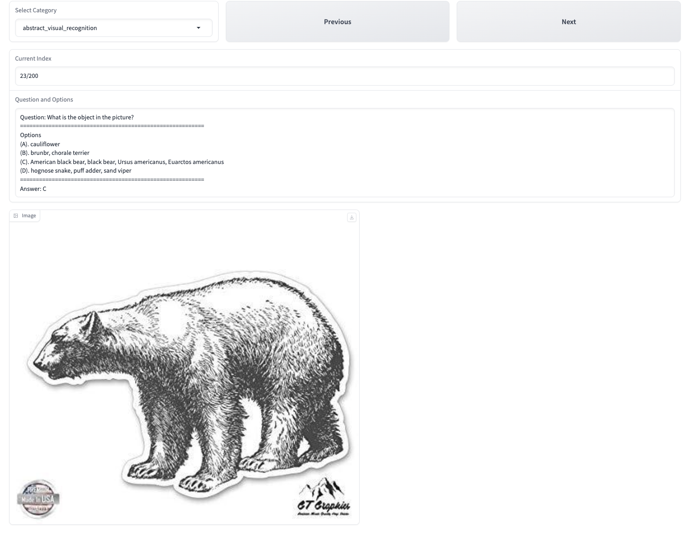

**Update**: 2024.3.28. We upload the preview code of the metadata generation. We place the code under the `data_process` directory.

# MMT-Bench

This repository contains code to evaluate LVLMs on the MMT-Bench.

# QuickStart

## Step0. Environment Setup

```shell
conda create -n mmtbench python=3.9 -y
conda activate mmtbench

pip install -e .
```

## Step1. Configuration

**MMT-Bench Download**: You can download MMT-Bench from [Hugging Face](https://huggingface.co/datasets/anonymous20240202/MMT-Bench) and put the `mmtbench.tsv` under the `./LMUData/`.

**VLM Configuration**: All VLMs are configured in `vlmeval/config.py`, for some VLMs, you need to configure the code root (MiniGPT-4, PandaGPT, etc.) or the model_weight root (LLaVA-v1-7B, etc.) before conducting the evaluation. During evaluation, you should use the model name specified in `supported_VLM` in `vlmeval/config.py` to select the VLM. For MiniGPT-4 and InstructBLIP, you also need to modify the config files in `vlmeval/vlm/misc` to configure LLM path and ckpt path.

Following VLMs require the configuration step:

**Code Preparation & Installation**: InstructBLIP ([LAVIS](https://github.com/salesforce/LAVIS)), LLaVA ([LLaVA](https://github.com/haotian-liu/LLaVA)), MiniGPT-4 ([MiniGPT-4](https://github.com/Vision-CAIR/MiniGPT-4)), mPLUG-Owl2 ([mPLUG-Owl2](https://github.com/X-PLUG/mPLUG-Owl/tree/main/mPLUG-Owl2)), OpenFlamingo-v2 ([OpenFlamingo](https://github.com/mlfoundations/open_flamingo)), PandaGPT-13B ([PandaGPT](https://github.com/yxuansu/PandaGPT)), TransCore-M ([TransCore-M](https://github.com/PCIResearch/TransCore-M)), LLaVA-XTuner ([XTuner](https://github.com/InternLM/xtuner)). 

**Manual Weight Preparation & Configuration**: InstructBLIP, LLaVA-v1-7B, MiniGPT-4, OpenFlamingo-v2, PandaGPT-13B

### Step2. Evaluation 

We use `run.py` for evaluation. To use the script, you can use `$VLMEvalKit/run.py` or create a soft-link of the script (to use the script anywhere):

**API Setting**

You should set the API in `run.py`.

**Arguments**

- `--data (list[str])`: Set the dataset names that are supported in VLMEvalKit (defined in `vlmeval/utils/data_util.py`, here we only consider the mmtbench). 
- `--model (list[str])`: Set the VLM names that are supported in VLMEvalKit (defined in `supported_VLM` in `vlmeval/config.py`). 
- `--mode (str, default to 'all', choices are ['all', 'infer'])`: When `mode` set to "all", will perform both inference and evaluation; when set to "infer", will only perform the inference.
- `--nproc (int, default to 4)`: The number of threads for OpenAI API calling.
- `--verbose (bool, store_true)`

**Command**

You can run the script with `python` or `torchrun`:

```bash
# When running with `python`, only one VLM instance is instantiated, and it might use multiple GPUs (depending on its default behavior). 

# llava_v1.5_7b on mmtbench, Inference and Evalution
python run.py --data mmtbench --model llava_v1.5_7b --verbose 

# When running with `torchrun`, one VLM instance is instantiated on each GPU. It can speed up the inference. 
# However, that is only suitable for VLMs that consume small amounts of GPU memory. 

# llava_v1.5_7b, Qwen-VL-Chat, mPLUG-Owl2 onmmtbench. On a node with 8 GPU. Inference and Evaluation.
torchrun --nproc-per-node=8 run.py --data  --model llava_v1.5_7b  qwen_chat mPLUG-Owl2 --verbose
```

The evaluation results will be printed as logs, besides. **Result Files** will also be generated in the directory `$YOUR_WORKING_DIRECTORY/{model_name}`. Files ending with `.csv` contain the evaluated metrics. 

# Visualize the MMT-Bench

You can visualize the MMT-Bnech with gradio.

```
pip install gradio
python visualize.py
```

Here is the screenshot of the visualize interface.

